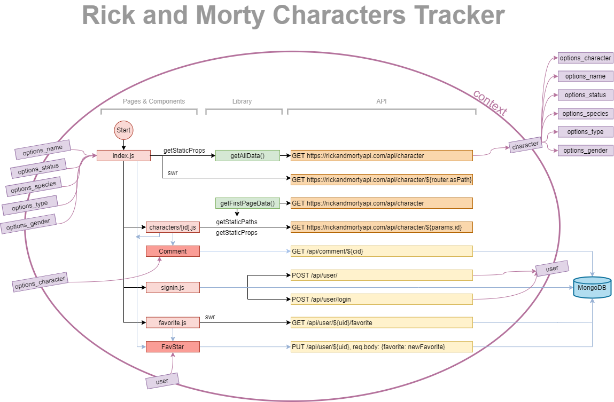

# Rick-and-Morty-Characters-Tracker

### LIVE LINK: 

[https://rick-and-morty-characters-tracker.kueichinhuang.vercel.app/](https://rick-and-morty-characters-tracker.kueichinhuang.vercel.app/)

### Project Introduction

This project is a part of my interview process as well as my #100DaysOfCode progress. I'm opened to any advice and suggestion!

1. Language & Framework: Next.js
2. User stories: User can list, filter, and save as favorites characters from Rick and Morty show
3. API: [https://rickandmortyapi.com/documentation/#rest](https://rickandmortyapi.com/documentation/#rest)
4. Database: MongoDB
5. Technical achievements:
      1. SSR & SSG: get static data when rendering / building
      2. SWR + Axios: fetch dynamic data
      2. bcrypt to hash password

# #100DaysOfCode
Check out my whole proecss at twitter 👉 [@KC78215273](https://twitter.com/KC78215273)
### Day 4 of #100DaysOfCode

**Next.js + Docker**

1. Install Docker on my Ubuntu VM: [https://docs.docker.com/engine/install/ubuntu/](https://docs.docker.com/engine/install/ubuntu/)
2. Create Next.js project and a Dockerfile (Tutorial: Containerize a Next.js app)
3. Run docker build to create an image
   - To build the image
      - `docker build --tag myImageName .`
      - the dot at the end is the path
   - To checkout the images that I built
      - `docker images`
   - To run my container on port 3333 (So that I can hit my application in a browser at [http://localhost:3333](http://localhost:3333/))
      - `docker run -d -p 3333:3000 myImageName`
   - or give our process a name
      - `docker run -p 3333:3000 --name myContainerName -d myImageName`
   - We can see the list of our running containers
      - `docker ps`
   - or we can see the list of all the containers
      - `docker ps -a`
4. Fetch external API in Next.js project

**Learning Resources**

1. Containerize a Next.js app (31 July 2020) [https://thomasgouveia.fr/blog/containerize-next-js.html](https://thomasgouveia.fr/blog/containerize-next-js.html)
2. Getting start w/ Next.JS + Docker (09 May 2019) [https://www.ballistiq.com/blog/Getting-started-w-Next-JS-Docker](https://www.ballistiq.com/blog/Getting-started-w-Next-JS-Docker)
3. How to Get Started with Docker (Aug 14, 2020) [How to Get Started with Docker](https://youtu.be/iqqDU2crIEQ)

### Day 5 of #100DaysOfCode

**Next.js & SSR**

1. Practice Server-side Rendering (SSR) in Next.js for SEO purpose
2. Filter
3. Next.js + MongoDB

**Learning Resources**

1. Next.js Official Tutorials (latest version) [https://nextjs.org/learn/basics/data-fetching](https://nextjs.org/learn/basics/data-fetching)
2. Static Site Generation (SSG) with external API (at 24:00) (Jan 19, 2018) [Next.js Crash Course - Server Side React](https://youtu.be/IkOVe40Sy0U)
3. Dynamic Routing with external API (Apr 26, 2020) [Making Websites With Next.js And Strapi - [06] - Dynamic Routes](https://youtu.be/RDcW_0iB5UE)
4. Fetching Data in Next.js (Jul 21, 2020) [Next.js 9.3+ Data Fetching Explained: getServerSideProps(), getStaticProps(), and getStaticPaths()](https://youtu.be/eWObYvG0-lI)
5. How to Integrate MongoDB Into Your Next.js App (Sep 10, 2020) [https://developer.mongodb.com/how-to/nextjs-with-mongodb](https://developer.mongodb.com/how-to/nextjs-with-mongodb)

### Day 6 of #100DaysOfCode

**Fixing timeout issue**

1. **Issue from yesterday** : Home page would time out due to huge data amount

2. **Goal &amp; Limitation** : Implementing SSR is one of the main resaon of using Next.js, but &quot;getStaticProps()&quot; and &quot;getServerSideProps()&quot; can&#39;t work together in the same page.
3. **Possible Solutions** :

   - Implement react package: Infinite Scroll [https://www.npmjs.com/package/infinite-scroll](https://www.npmjs.com/package/infinite-scroll)

     - pros: clean and fast
     - cons: I failed to integrate this package with Next.js SSR solution

   - Build the infinite scrolling manually: looks very dirty
   - Multiple components for home page: less dirty in my opinion ...

4. **Selected Solution** :
   - When user load all the data: go to the page use &quot;getStaticProps()&quot;;
   - When user filter something: go to the page use &quot;getServerSideProps&quot;.
   - User would feel that they&#39;re on the same page (index page) but they&#39;re actually in different pages when they filter the data.

      - HomeIndex component: Doing &quot;getStaticProps()&quot; --> static data --> pass to Home component
      - HomeFilter component: Doing &quot;getServerSideProps()&quot; --> fetch data when request --> pass to Home component
      - Home component

5. **Result** : The solution might be horrible but the result seems OK. Hope will find a better solution soon.

6. Next.js &amp; API Routes

   - I built the back-end application endpoints in pages/api that can fetch my data from external API, but it seems useless because I can&#39;t use that in &quot;getStaticProps()&quot; and &quot;getServerSideProps()&quot;. I currently use some stupid way to get the external data in my library.

### Day 7 of #100DaysOfCode

**API and User Authentication**

1. Tried to use the api endpoint that I set up in my app to fetch the external data for user

   - failed, because only absolute URL is allowed in pages.

2. User Authentication with Auth0

   - User can login/logout, but I gonna try to store user&#39;s session info using useContext tomorrow.
   - The user authentication in the server-less model is not the same as MERN stack so I had a hard time figuring out a better practice of authentication in Next.js.

**Learning Resources**

1. The Ultimate Guide to Next.js Authentication with Auth0 (October 10, 2019) [https://auth0.com/blog/ultimate-guide-nextjs-authentication-auth0/](https://auth0.com/blog/ultimate-guide-nextjs-authentication-auth0/)
2. @auth0/nextjs-auth0 (README.md: 15 days ago) [https://github.com/auth0/nextjs-auth0](https://github.com/auth0/nextjs-auth0)

### Day 8 of #100DaysOfCode

**User Sessions**

1. Dump Auth0 and use useContext (temporary) for user session
2. Use mongoose for data schema
3. Live Link: [https://rick-and-morty-characters-tracker-44d4hr16r.vercel.app/](https://rick-and-morty-characters-tracker-44d4hr16r.vercel.app/)
4. Magic could be another solution for authentication with Next.js
5. Redirect in &#39;react-router-dom&#39; is router.push(href) in Next.js!

**Learning Resources**

1. User session with useContext in Next.js (Sep 06, 2019) [https://reacttricks.com/sharing-global-data-in-next-with-custom-app-and-usecontext-hook/](https://reacttricks.com/sharing-global-data-in-next-with-custom-app-and-usecontext-hook/)
2. A more modern way to useContex in Next.js (3 months ago) [https://kaloraat.com/articles/nextjs-react-context-tutorial-how-to-use-context-api-with-nextjs](https://kaloraat.com/articles/nextjs-react-context-tutorial-how-to-use-context-api-with-nextjs)
3. NextJS + MongoDB (Mar 26, 2020) [Build an app with NextJS and MongoDB - Part 1](https://youtu.be/tt9hws5JGRc)
4. Redirect in Next.js [https://nextjs.org/docs/api-reference/next/router#routerpush](https://nextjs.org/docs/api-reference/next/router#routerpush)

### Day 9 of #100DaysOfCode

**Users and their favorites**

1. User can login/logout
2. User can add/remove the character to/from their favorite collection (External API + my MongoDB)

**Learning Resources**

1. If fetching data on client side, SWR is super fast --\&gt; [React Hooks SWR: Fetch, Cache and ReValidate server data with SWR and Axios](https://youtu.be/a7JigiLw_OY)

### Day 10 of #100DaysOfCode

**First State Finished**

1. Styles
2. User can only see the filter when they log in
3. User can only add favorite when they log in
4. Debug deployment issue on Vercel
   - Issue: local build succeed but remote build failed
   - Error message: ModuleNotFoundError: Module not found: Error: Can't resolve ... Error: > Build failed because of webpack errors
   - The reply I got from their technican: [https://vercel.com/knowledge/how-do-i-resolve-a-module-not-found-error](https://vercel.com/knowledge/how-do-i-resolve-a-module-not-found-error)

### Day 11 of #100DaysOfCode

1. I suddenly realize that the thing I learned on Day 9 is the best solution of the challenge I met on Day 6!!!!
2. Debug on Vercel deployment. Preview deployment can&#39;t get the environment variables like master branch.
3. Working on User&#39;s Favorite page.

### Day 12 of #100DaysOfCode

**Progress:**

Favorite page:
1. Building Favorite page:
2. rename Home component to Card
3. set up an page use Layout
4. in Layout: change &quot;Go back to Home&quot; to &quot;Go back to last page&quot;
5. get data --> my API endpoint --> MongoDB (user&#39;s data: favorite characters&#39; ids) --> get data from external API (characters&#39; data)
6. use Card to display the results

**Something is still broken:**

1. to catch the error when can&#39;t get the result from external api
2. clean button is not working because of cache?
3. it&#39;s not loading my data when i first sign in?

**Next Must:**

1. comments + MongoDB
2. Loading sign

**Can Do better:**

1. filter with dropdown menu
2. set up a reducer + context

### Day 13 of #100DaysOfCode

**Progress:**

1. Favorite page:
   1. User can remove character from their favorite collection
   2. Confirm window would pop up before user remove the character

2. Detail page:
   1. User should be able to add / remove character to / from favorite collection
   2. Make Favorite button a component

3. Comments + MongoDB:
   1. create data schema for Comment
   2. create GET and POST API for Comment
   3. create frontend for comments
   4. try to combine API and frontend

**Something is still broken:**

1. clean button is not working because of cache?

**Next Must:**

1. Loading sign

**Can Do better:**

1. filter with dropdown menu
2. set up a reducer + context

### Day 14 of #100DaysOfCode

**Progress:**

Comments + MongoDB:

  1. user can leave the comment as one of the character
  2. the character cannot leave the comment on itself

**Something is still broken:**

1. clean button is not working because of cache?
2. error message for no search result

**Next Must:**

1. Loading sign

**Can Do better:**

1. filter with dropdown menu
2. set up a reducer + context

### Day 15 of #100DaysOfCode

**Progress:**

1. Error feedback when filtering
2. Error feedback when commenting
3. Clear button at Index page
4. Loading sign in favorite page

**Something is still broken:**

1. Index page: after reset the filter, inputs can&#39;t get the cache value from browser
2. Can&#39;t reset the comment author after navigate to other character page from history

**Can Do better:**

1. filter with dropdown menu
2. set up a reducer + context

**Learning Resources**

1. react-select [https://react-select.com/home](https://react-select.com/home)
2. react-loading [https://www.npmjs.com/package/react-loading](https://www.npmjs.com/package/react-loading)